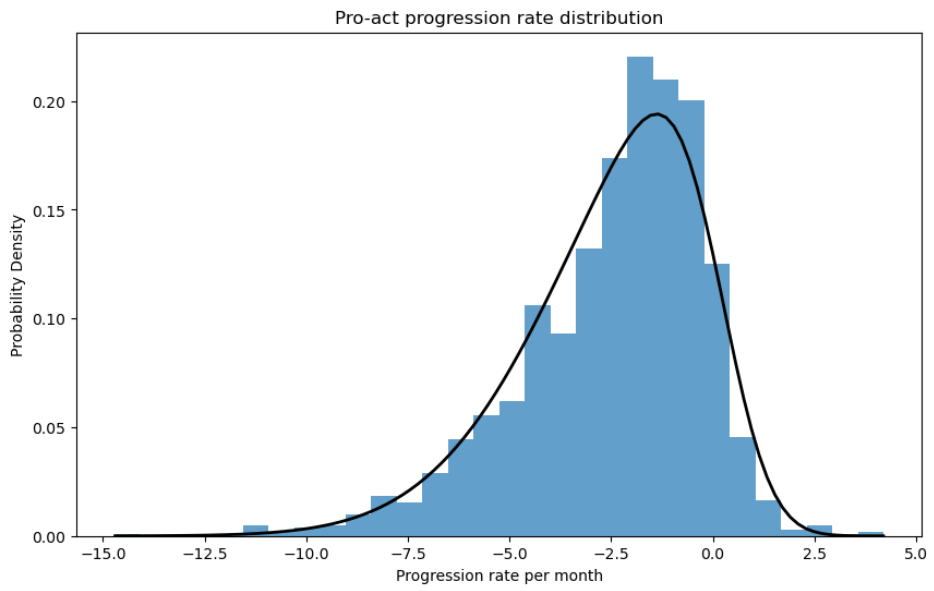

# ALSTracker Technical Background

This page is intendet for a readership with a technical background:

## Priors

### ALSFRS-R Score

The priors for the ALSFRS-R I take from the pro-act [1] database. If you fit a skewed normal distribution to the measured progression rates you get the following fit:


This distribution is used as prior distribution in ALSTracker.

Here is the definition with [bambi](https://bambinos.github.io/bambi/):

```python
slope_prior = bmb.Prior(
    'SkewNormal', 
    alpha=-5.46, 
    mu=-0.00252, 
    sigma=0.035
)

```


### Vital Capacity

Same analysis as for the ALSFRS-R score I did for the forced vital capacity:



I use the same distribution as prior for the slope.

Here is the definition with [bambi](https://bambinos.github.io/bambi/):

```python
slope_prior = bmb.Prior(
    "SkewNormal", 
    alpha=-3.479654, 
    mu=0.0058026, 
    sigma=0.1149874
)
```


### Neurofilament light chain

In Witzel et al [2] there is written:

> The individual median longitudinal NfL change was close to zero (+1.4 pg/mL),	 with	 80%	 of	 the	 individual	 deviation	 from	 BL	 values	 found	 in	 a	        # range	 between	 −17.6 pg/mL	 (10th	 percentile)	 and +22.1 pg/mL	(90th	percentile),	and	half	of	the	values	even	in	a	 narrow	range between	−5.6 pg/mL	(25th	percentile)	and +14.2 pg/mL	 (75th	percentile).

The IQR (from 25th to 75th percentile) is the range between −5.6 pg/mL and +14.2 pg/mL. 
Difference = 14.2 - (-5.6) = 19.8 pg/mL. 

In a normal distribution, the IQR is approximately 1.35 times the standard deviation. 19.8/1.35 = 14.66. Therefore I set the sigma for the inter-patient variation to 15.
        
Over all patients Median is 51.8. IQR is 35.5 to 85.9.  85.9 - 35.5 = 50.4, SD = 50.4/1.35 = 37.33. Therefore I set the intra-patient variation to 38.

Here is the definition with [bambi](https://bambinos.github.io/bambi/):
```python
priors = {
    "Intercept": bmb.Prior("Normal", mu=51.8, sigma=37.33),
    "sigma": bmb.Prior("HalfNormal", sigma=15),
}
```


## References

[1]  "PRO-ACT Dataset is the world’s largest ALS clinical trial data repository, compiling placebo and treatment-arm data from 30 phase II/III clinical trials and 12,229 fully anonymized longitudinal Subject records funded by The ALS Therapy Alliance, Prize4Life, Inc., Northeast ALS Consortium (NEALS), Neurological Clinical Research Institute of Mass. General Hospital, ALS Finding A Cure, and The ALS Association. Neurological Clinical Research Institute of Mass. General Hospital created and maintained the PRO-ACT Dataset and serves as the coordinating center and data distributor of the PRO-ACT Dataset. Find out more at www.alsdatabase.org" 

[2] Witzel S, Statland JM, Steinacker P, Otto M, Dorst J, Schuster J, Barohn RJ, Ludolph AC. Longitudinal course of neurofilament light chain levels in amyotrophic lateral sclerosis-insights from a completed randomized controlled trial with rasagiline. Eur J Neurol. 2024 Mar;31(3):e16154. doi: 10.1111/ene.16154. Epub 2023 Nov 17. PMID: 37975796; PMCID: PMC11235763.